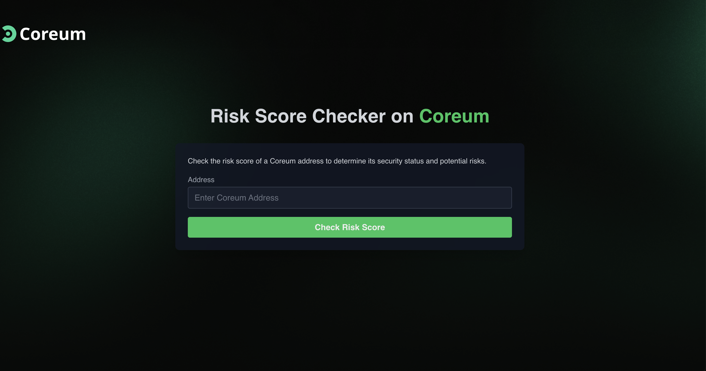

# AnChain Risk Score Application Workshop



This workshop demonstrates how to build a full-stack application that utilizes **AnChain APIs** to retrieve and display **risk scores**. The frontend is built with **Next.js**, using **Axios** to communicate with a **Python backend** that interacts with AnChain's API.

Participants will learn how to integrate third-party APIs into a full-stack application, handle API requests on both the backend and frontend, and display risk scores in a user-friendly way using modern web technologies.

## Learning Objectives

By the end of this workshop, you will be able to:

- Understand how to use **AnChain APIs** to retrieve risk scores.
- Build a full-stack application using **Next.js** for the frontend and **Python** for the backend.
- Use **Axios** to send HTTP requests from the frontend to the backend.
- Set up a Python backend to interact with AnChain APIs.
- Display risk scores and handle API responses effectively in the frontend.

## Prerequisites

Before attending the workshop, please ensure you have the following:

- Basic understanding of the blockchain and risk scoring systems.
- Familiarity with **JavaScript**, **TypeScript**, and **React**.
- Experience with **Next.js** and **Node.js**.
- Basic knowledge of **Python** and **Flask** or similar web frameworks.
- A code editor of your choice (e.g., **VS Code**).

## Project Architecture

- **Frontend**: Built with **Next.js** for a React-based frontend, **Axios** for making API requests, and styled components for the UI.
- **Backend**: Built with **Python**, using **Flask** (or FastAPI) to interact with AnChain's API and handle data processing.

## Setup

### Backend (Python)

1. **Install Python**: Ensure that you have Python installed. You can download it from [here](https://www.python.org/downloads/).

2. **Clone the Repository**:

   ```bash
   git clone https://github.com/yourusername/anchain-risk-score-app.git
   cd anchain-risk-score-app/backend
   ```

3. **Install Python dependencies**:

If you are using `pip`, run:

```bash
pip install -r requirements.txt
```

4. **Run Python Backend**:
```bash
uvicorn main:app --reload
```

5. **Run Frontend Backend**:
```bash
npm install
npm run dev
```
